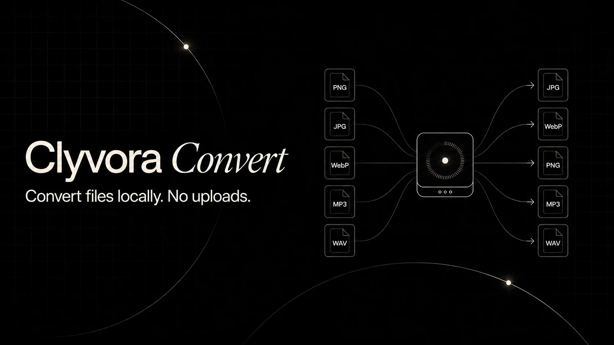

# Clyvora Convert

> Convert media locally. No uploads, waiting, or accounts.

Clyvora Convert is an open-source image, audio, and video converter that runs entirely in the browser. Selected files are processed on the user's device and are never sent to a conversion server.

**Use it online:** [convert.clyvora.tech](https://convert.clyvora.tech/)



## Why Clyvora Convert?

- **Private conversion:** no accounts, analytics, cloud storage, or external conversion API. Optional link resolution sends only the pasted URL to the configured resolver.
- **Local-first:** native browser image tools and a self-hosted FFmpeg WebAssembly worker do the work.
- **Focused:** only deliberately supported conversion pairs are shown.
- **Batch-friendly:** multiple files, sequential processing, retry, cancellation, collision-safe names, and ZIP export.
- **Offline-capable:** the interface and conversion assets work offline after the required files have been cached.
- **Accessible:** keyboard navigation, visible focus states, status announcements, and reduced-motion support.

## Supported conversions

| Input | Output |
| --- | --- |
| PNG | JPG, WebP |
| JPG / JPEG | PNG, WebP |
| WebP | PNG, JPG |
| MP3 | WAV, OGG, Opus |
| WAV | MP3, OGG, Opus |
| OGG | MP3, WAV, Opus |
| Opus | MP3, WAV, OGG |
| MP4 | WebM, MP3, WAV, OGG, Opus |
| WebM | MP4, MP3, WAV, OGG, Opus |

File signatures are inspected instead of trusting extensions alone. Renamed, damaged, or unsupported files are rejected with a clear explanation.

## Features

- Drag-and-drop, multiple selection, and clipboard image paste.
- Direct HTTPS media-link imports when the original host permits browser access.
- Optional built-in SoundCloud importing for public playable tracks, share links, and unlisted access-key links, using a narrowly scoped resolver that never receives the audio bytes.
- A compact conversion queue with per-file output selection, progress, retry, and editing after completion.
- Image resize controls with aspect-ratio locking, no-upscale protection, JPG/WebP quality, and a selectable JPG transparency background.
- Video quality, maximum resolution, codec, and audio-bitrate controls.
- Audio bitrate, channel, and sample-rate controls.
- Native image comparison plus audio and video playback before and after conversion.
- Remembered local preferences and "apply to compatible files."
- Result dimensions, elapsed time, size change, and device-memory guidance.
- Lazy media-engine loading with separate loading and conversion states.
- Automatic downloads as each conversion finishes, individual re-downloads, and lazy "Download all as ZIP."

## Quick start

Requirements: Node.js 20 or newer and npm.

After cloning the repository:

```bash
npm install
npm run dev
```

To test SoundCloud links locally as well, install the packages in `proxy` once and run `pnpm dev:links`. This starts both the site and its local resolver; no Cloudflare account is needed for local testing.

The development command copies the installed FFmpeg runtime into `public/ffmpeg` before starting Vite. Those generated files are intentionally excluded from source control.

## Commands

| Command | Purpose |
| --- | --- |
| `npm run dev` | Prepare FFmpeg assets and start development |
| `pnpm dev:links` | Start the site together with the local SoundCloud resolver |
| `npm run build` | Type-check and create a production build |
| `npm run preview` | Preview the production build with required headers |
| `npm test` | Run all automated tests |
| `npm run test:unit` | Run core and conversion-engine tests |
| `npm run test:integration` | Run UI and image-pipeline integration tests |
| `npm run test:media` | Run real audio/video conversions through FFmpeg WebAssembly in a browser |
| `npm run lint` | Run the source-code linter |
| `npm run prepare:ffmpeg` | Regenerate local FFmpeg runtime assets |

The media integration suite launches Chromium headlessly and performs real conversions through the self-hosted WebAssembly runtime. It uses `BROWSER_EXECUTABLE_PATH` when set, otherwise a detected Brave, Chrome, or Edge installation on Windows, and finally Playwright's installed Chromium.

## Architecture

```text
src/core             signatures, registry, validation, naming, queue and preferences
src/engines/image    native browser image decoding, canvas rendering and encoding
src/engines/audio    lazy FFmpeg audio/video worker and temporary-file cleanup
src/App.tsx          interface, orchestration, cancellation and downloads
proxy                 optional Cloudflare Worker for permitted SoundCloud links
public/sw.js         same-origin runtime caching for offline use
```

Image conversion prefers `createImageBitmap` and `OffscreenCanvas`, with safe browser fallbacks. It does not load FFmpeg.

Audio and video conversion dynamically import `@ffmpeg/ffmpeg`. Audio uses the multithreaded core when cross-origin isolation and `SharedArrayBuffer` are available. Video uses the stable single-threaded core. The heavy core assets are not part of the initial JavaScript bundle.

## Privacy boundary

Clyvora Convert does not contain an upload path. Object URLs, canvases, local buffers, and FFmpeg's in-browser virtual filesystem keep selected media on the device. When a user explicitly imports a direct link, the browser contacts that link's original host.

When the optional SoundCloud resolver is configured, the pasted SoundCloud URL is sent to that Worker. The Worker resolves a public non-encrypted playback stream and returns a short-lived SoundCloud CDN address; the browser downloads the audio directly from SoundCloud, so file contents do not pass through or get stored by the Worker. The service worker fetches and caches only same-origin application assets.

Contributions must not add telemetry containing filenames or file contents. Any future network feature must be isolated from selected media and receive an explicit privacy review.

## Hosting requirements

Multithreaded FFmpeg requires these response headers:

```text
Cross-Origin-Opener-Policy: same-origin
Cross-Origin-Embedder-Policy: require-corp
```

Vite development and preview already set them. `public/_headers` provides an example for compatible static hosts. Other hosts need equivalent configuration. Without cross-origin isolation, the application automatically uses the single-threaded fallback.

For offline use, users must first visit the production application and load the conversion assets they need. Clearing site data removes the cache.

## Browser and performance limitations

- Browser codec and canvas support varies, particularly for WebP encoding.
- Large image drawing or encoding may briefly occupy the main thread.
- Each FFmpeg core is roughly 32 MB before transfer compression and needs additional working memory.
- Very large conversions can exceed a browser tab's memory ceiling, especially on mobile devices.
- Image cancellation is cooperative; a native encode may finish internally before its discarded result is released.
- EXIF and other source metadata are not preserved.
- Transcoding cannot restore quality already lost in the source. WAV outputs and high-quality video settings can substantially increase file size.
- Video conversion is CPU- and memory-intensive in a browser, particularly on mobile devices.
- Link imports depend on the original host allowing cross-origin browser requests and linking directly to a supported media file.
- SoundCloud importing requires the optional resolver deployment, public page structure that can change without notice, and a playable non-DRM progressive stream. Unlisted links work when the complete access-key link is supplied; account-only private, paid, regional, encrypted, and unsupported stream formats do not.

## Optional SoundCloud resolver

The resolver in [`proxy`](proxy) is designed for Cloudflare Workers' free tier. It resolves metadata only; media bandwidth goes directly from SoundCloud's CORS-enabled CDN to the browser. Follow [`proxy/README.md`](proxy/README.md) to configure the exact allowed site origin and deploy it.

If the Worker is routed to `/api/soundcloud/resolve` on the same domain, no frontend setting is required. Otherwise, build the app with `VITE_MEDIA_RESOLVER_URL` set to the Worker's `/v1/soundcloud/resolve` URL and add that exact origin to the production Content Security Policy.

No hosting provider guarantees that a free tier will exist forever. Cloudflare currently applies daily request and CPU limits, and SoundCloud can change its page structure, delivery formats, or policies independently.

## Contributing

Contributions are welcome. Read [CONTRIBUTING.md](CONTRIBUTING.md) before opening a pull request. Please keep version-one format scope deliberate and include tests for new detection, validation, conversion, failure, cancellation, and cleanup behavior.

For sensitive vulnerability reports, follow [SECURITY.md](SECURITY.md).

## License

The original Clyvora Convert source code is available under the [MIT License](LICENSE).

FFmpeg and the generated `@ffmpeg/core` / `@ffmpeg/core-mt` runtime assets are separate third-party works licensed under **GPL-2.0-or-later**. A deployed build that includes those assets must satisfy the applicable GPL obligations. See [THIRD_PARTY_NOTICES.md](THIRD_PARTY_NOTICES.md) and [public/ffmpeg/README.md](public/ffmpeg/README.md). This section is a project-maintenance note, not legal advice.
